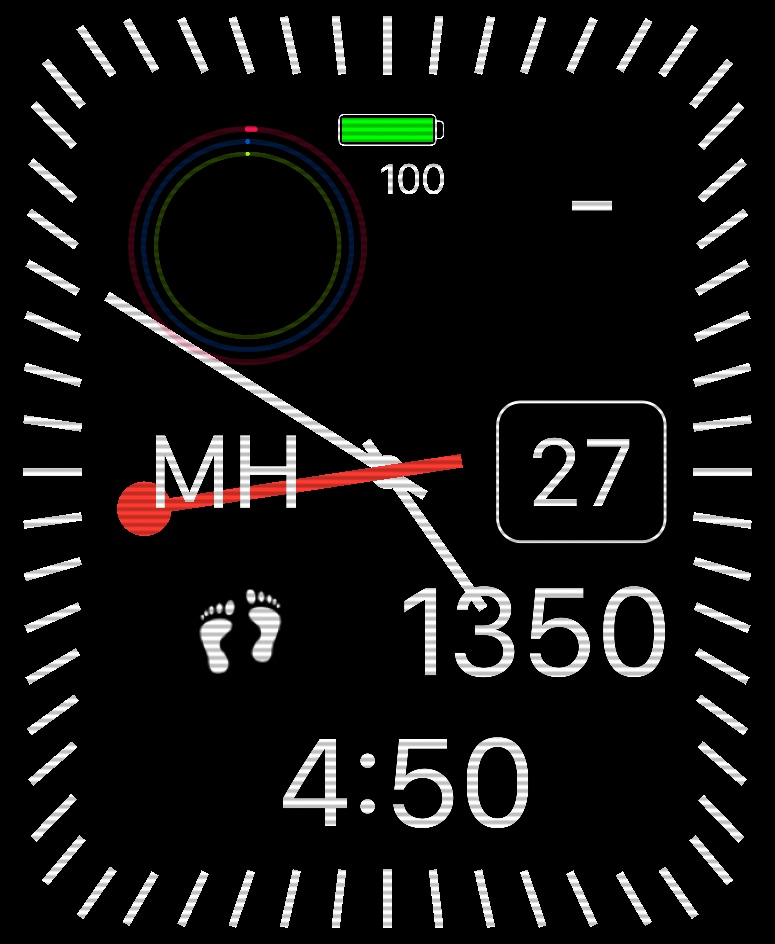

# OpenClockStandard
an open clock standard for clock designs.  For use on multiple software and [hardware](https://github.com/sqfmi/Watchy) [projects](https://github.com/wiz78/WeatherClock).

Format is supported in the clock editing application [clockology for iOS & MacOS](https://clockologyapp.com/) to make the designs portable to other projects.  Other uses might be for [widgets](https://widgetyapp.com/), dashboards, etc. 

## Layout

0,0 is the center of the layout
positive Y ( vertical position ) is down

## Layers

The layout is determined by a list of "layers" of items that make up the overall design.  

Current layer types supported are:
* Time: labels to show dates and times
* Icons: icons used to designate types of information on the face
* Hands: items that rotate automatically based on the time unit they are set to

Check out the JSON in json folder

## Examples

This layout is used for example JSON in the /json folder.  It uses all the supported layer types and has options added for each layer to store the properties.